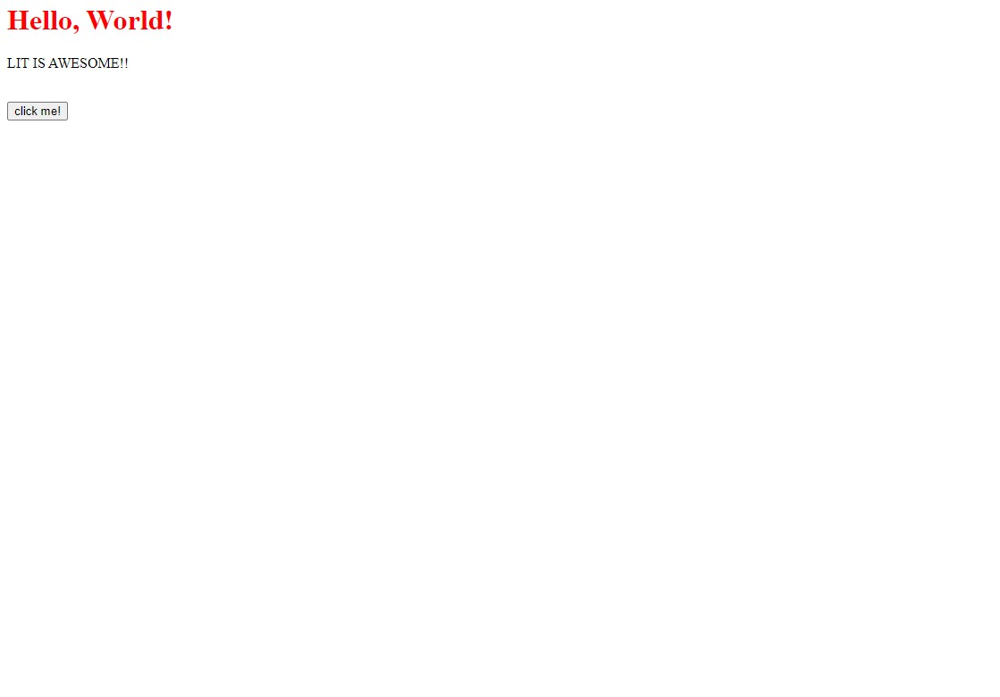

# The Lit Programming Language

Lit is a language for front-end development.

## Examples:

Rendering HTML:
```jsx
render {
  <style>
    h1 {
      color: red;
    }
  </style>
  <h1>Hello, World!</h1>
  <p>LIT IS AWESOME!!</p><br />

  <button onclick="alert('yo js is working!')">click me!</button>
}
```

Preview:
